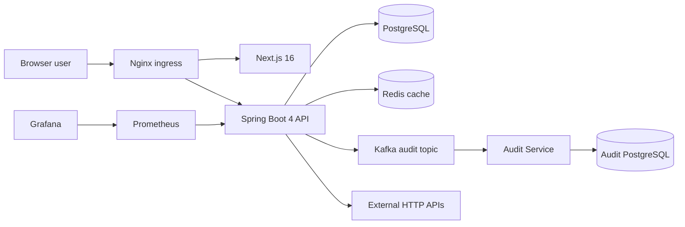

# VaultScale

**VaultScale is a multi-tenant API operations workspace built to demonstrate secure backend design, event-driven processing, observability, reliability patterns, and measurable performance.**

Teams work inside organizations, group reusable HTTP requests into collections, execute saved endpoints through a guarded request runner, and inspect execution history. The main API uses PostgreSQL and Redis, emits audit events through Kafka, and delegates audit persistence to a standalone consumer service with its own database.

## Engineering impact

Measured local benchmark baseline in [`qa/impact/benchmark-results.md`](qa/impact/benchmark-results.md):

| Result | Measured value |
| --- | ---: |
| Load test | **200 VUs, 387.66 req/s, 22.51 ms P95, 0% errors** |
| Redis repeated-read latency | **27.74% average reduction** |
| Controlled Redis hit rate | **90.91%** |
| Kafka persistence throughput | **166.50 events/s, 500/500 persisted** |
| Kafka lag recovery | **peak 500 -> final 0** |
| PostgreSQL controlled index comparison | **99.77% lower measured execution time over 200k rows** |

These are controlled **local** measurements from the recorded benchmark environment, not production-capacity claims. The report preserves methodology, hardware, resource usage, and limitations. Circuit-breaker performance remains intentionally unclaimed until the post-hardening benchmark is rerun.

## What is implemented

- **Authentication:** JWT registration/login, BCrypt password hashing, explicit `401` handling, protected `/auth/me`.
- **Multi-tenancy:** organization membership with `OWNER`, `ADMIN`, `MEMBER`, `VIEWER` roles.
- **Tenant-safe nested resources:** every collection/endpoint/run-history path verifies the child belongs to the parent organization/collection instead of trusting IDs from the URL.
- **Collections and saved endpoints:** method, URL, headers, optional body, and execution history.
- **Outbound request security:** HTTP/HTTPS-only preflight, embedded-credential rejection, all resolved addresses checked against private/reserved ranges, redirect blocking, timeouts.
- **Resilience:** programmatic Resilience4j circuit breaker around only the external network operation; state/failure/buffer metrics exposed through Micrometer.
- **Redis:** user-keyed `myOrgs` cache with TTL and write-side invalidation.
- **Kafka audit pipeline:** `ORG_CREATED` events published to `vaultscale.audit.events`; standalone Audit Service consumes and persists to its own PostgreSQL database.
- **Observability:** Actuator, Micrometer, Prometheus, Grafana, structured logs, cache metrics, circuit-breaker gauges.
- **Infrastructure:** Docker Compose, Nginx ingress, OCI Terraform target, Docker health checks, GitHub Actions CI.
- **Testing:** unit/integration tests with JUnit/Mockito/Testcontainers plus tenant-isolation and breaker state regression tests.

## Architecture



The default Compose trust boundary exposes **Nginx on port 80** to all interfaces. Direct backend/frontend/audit/monitoring/Kafka debug ports are localhost-bound, while main PostgreSQL and Redis stay on the private Compose network.

Deep-dive documentation:

| Document | Purpose |
| --- | --- |
| [Architecture](docs/architecture.md) | Tenancy, authentication, request execution, SSRF, circuit breaker, caching, Kafka, data ownership, observability. |
| [Deployment](docs/deployment.md) | Compose networking, secrets, OCI Terraform, HTTPS boundary, verification. |
| [System context](docs/diagrams/system-context.drawio) | User, VaultScale, external APIs. |
| [Container architecture](docs/diagrams/container-architecture.drawio) | Runtime components and data/event paths. |
| [Compose deployment](docs/diagrams/compose-deployment.drawio) | Public vs localhost/private exposure. |
| [Database model](docs/diagrams/database-model.drawio) | Main and audit data ownership. |
| [Auth and RBAC](docs/diagrams/authentication-rbac-sequence.drawio) | JWT and role authorization sequence. |
| [Endpoint execution](docs/diagrams/endpoint-execution-flow.drawio) | Tenant checks -> SSRF -> circuit breaker -> HTTP -> history. |
| [Audit pipeline](docs/diagrams/audit-event-pipeline.drawio) | Kafka publish/consume/backlog recovery. |

## Stack

| Layer | Technology |
| --- | --- |
| Frontend | Next.js 16, React 19, TypeScript |
| Main API | Java 21, Spring Boot 4, Spring Security, Spring Data JPA |
| Persistence | PostgreSQL 16, Flyway |
| Cache | Redis 7, Spring Cache |
| Events | Kafka (Confluent Platform 7.6 local image), standalone Audit Service |
| Resilience | Resilience4j core circuit breaker |
| Edge | Nginx |
| Observability | Actuator, Micrometer, Prometheus, Grafana |
| Tests | JUnit, Mockito, Testcontainers, k6 benchmark scripts |
| DevOps | Docker Compose, GitHub Actions, Terraform/OCI target |

## Local run

Prerequisite: Docker Engine + Docker Compose.

```bash
cp .env.example .env   # optional; replace real-deployment secrets before public use
docker compose up -d --build
docker compose ps
```

Open:

- application: `http://localhost`
- direct frontend debug: `http://localhost:3000`
- direct backend debug: `http://localhost:8080`
- Grafana: `http://localhost:3001`
- Prometheus: `http://localhost:9090`

Host-side Kafka tooling connects to `localhost:9092`; containers use `kafka:29092`.

Stop without deleting named database volumes:

```bash
docker compose down
```

## API overview

All application routes begin with `/api/v1`.

| Method | Route | Authorization / purpose |
| --- | --- | --- |
| `POST` | `/auth/register` | public registration |
| `POST` | `/auth/login` | public authentication |
| `GET` | `/auth/me` | authenticated identity |
| `POST` | `/orgs` | create org + owner membership |
| `GET` | `/orgs` | cached caller organization list |
| `POST` | `/orgs/{orgId}/members` | owner/admin member invitation; cannot assign OWNER |
| `POST`, `GET` | `/orgs/{orgId}/collections` | create/list collections |
| `DELETE` | `/orgs/{orgId}/collections/{collectionId}` | owner/admin; tenant ownership verified |
| `POST`, `GET` | `/orgs/{orgId}/collections/{collectionId}/endpoints` | create/list endpoints; parent ownership verified |
| `POST` | `/orgs/{orgId}/collections/{collectionId}/endpoints/{endpointId}/run` | owner/admin/member outbound execution |
| `GET` | `/orgs/{orgId}/collections/{collectionId}/endpoints/{endpointId}/history` | authorized history with nested tenant verification |

Audit persistence is currently an internal event-driven service, not a public audit-read API.

## Tests and CI

Local backend tests:

```bash
cd backend
./mvnw test
```

Audit Service:

```bash
cd services/audit-service
./mvnw test
```

Frontend:

```bash
cd frontend
npm ci
npm run lint
npm run build
```

GitHub Actions runs backend tests, Audit Service tests, frontend lint/build, and `docker compose config` on pull requests and `main` pushes.

Performance/reliability tooling lives in [`qa/impact/`](qa/impact/README.md).

## Security and reliability boundaries

The repository is deliberately explicit about what remains:

- the browser currently stores JWT in `localStorage`; it is not an HttpOnly-cookie session design;
- SSRF application checks are a preflight defense and redirects are disabled, but production egress firewall/policy remains the stronger DNS-rebinding boundary;
- Kafka publication is asynchronous but does not yet use a transactional outbox;
- local Compose is a single-machine topology, not high availability;
- Terraform is an OCI deployment target, not evidence that the core application is currently live there;
- checked-in Nginx is HTTP-only. A public deployment must add real TLS termination before claiming HTTPS;
- P99 and post-hardening circuit-breaker fail-fast latency have not yet been measured.

## OCI target

`infra/terraform` provisions an Ampere A1 VM at **2 OCPUs / 12 GB RAM**, matching the current documented OCI Always Free A1 allowance for an Always Free tenancy. It attaches an NSG to the VM VNIC, opens HTTP/80, and requires an explicit `ssh_allowed_cidr` for SSH instead of exposing port 22 to the world.

See [deployment.md](docs/deployment.md) before applying it.
