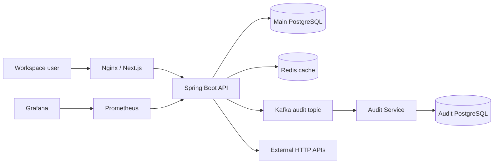
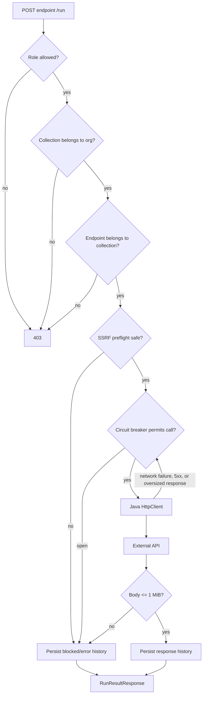
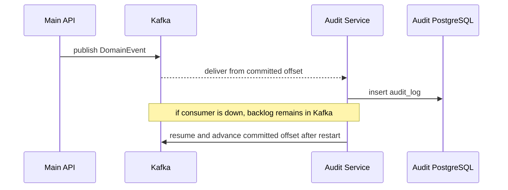

# VaultScale architecture

This document describes the code and deployment topology in the repository after the hardening pass. It intentionally separates **implemented behavior** from **deployment choices** and from **future work**. The defect-by-defect review is recorded in [`hardening-review.md`](hardening-review.md).

## System shape

VaultScale is a multi-tenant API operations workspace. The browser application stores and runs reusable HTTP requests inside organizations and collections. The main Spring Boot API owns authentication, tenancy, saved-request configuration, execution history, Redis-backed organization-list caching, and Kafka event production. Audit persistence is extracted into a separate consumer service with its own PostgreSQL database.



Editable Draw.io versions live in [`docs/diagrams/`](diagrams/README.md).

## Trust and tenant boundaries

A URL that contains `orgId`, `collectionId`, and `endpointId` is not trusted merely because the path is nested. The backend now proves every relationship before operating on the child resource:

```text
Authenticated user
  -> membership exists for orgId and role is allowed
  -> collectionId belongs to orgId
  -> endpointId belongs to collectionId
  -> operation is allowed
```

This prevents an authenticated member of one organization from substituting IDs from another organization into an otherwise valid URL.

Role policy used by the implemented paths:

| Capability | OWNER | ADMIN | MEMBER | VIEWER |
| --- | ---: | ---: | ---: | ---: |
| List organizations/collections/endpoints/history | yes | yes | yes | yes |
| Create collections/endpoints | yes | yes | yes | no |
| Execute an outbound saved request | yes | yes | yes | no |
| Invite members | yes | yes | no | no |
| Assign `OWNER` through invitation | no | no | no | no |

`OWNER` is tied to `organizations.owner_id`; the generic invitation path cannot manufacture additional owners.

## Authentication

Registration hashes passwords with BCrypt. Login authenticates through Spring Security and returns a signed JWT. Only `/api/v1/auth/register` and `/api/v1/auth/login` are anonymous application routes. `/api/v1/auth/me` and all organization/resource routes require a valid bearer token.

The current browser client stores the JWT in `localStorage`. That is an explicit current boundary, not equivalent to an HttpOnly session-cookie design. A production identity redesign could move to short-lived access tokens plus refresh/session handling without changing the tenant/resource model.

## Endpoint execution path



The request runner uses a 5-second connection timeout, 10-second request timeout, disabled redirects, and a **1 MiB maximum captured response body**. Oversized bodies are aborted instead of being buffered without limit in the JVM or stored in request history.

### SSRF guard

`SafeApiRequestValidator` performs a preflight check before the network call:

- only `http` and `https` schemes;
- no embedded URL credentials;
- a valid host and port;
- all DNS answers are inspected, not only the first address;
- loopback, any-local, link-local, site-local/private, multicast, carrier-grade NAT, common documentation ranges, reserved IPv4, and IPv6 unique-local targets are rejected;
- redirects are disabled in `HttpClient` so an allowed URL cannot redirect the client into a blocked private target.

This is still a **preflight** guard. `HttpClient` performs its own later DNS resolution, so network egress controls are still the stronger production boundary against DNS-rebinding/TOCTOU cases.

### Circuit breaker

The external network operation is wrapped by a programmatically configured Resilience4j `CircuitBreaker` named `externalApiRunner`. Database lookup, RBAC failures, tenant mismatches, and SSRF rejections happen outside the breaker so caller/configuration problems do not contaminate dependency health.

Current breaker defaults:

- count-based window: 10 calls;
- minimum calls: 5;
- failure threshold: 50%;
- slow-call threshold: 8 seconds / 50%;
- open wait: 15 seconds;
- half-open probes: 3.

Micrometer gauges expose the breaker state, failure rate, and buffered-call count. The existing local performance report does **not** claim a fail-fast percentage yet because that benchmark has not been rerun after this implementation change.

## Redis caching

`OrganizationService.getMyOrganizations(userId)` uses the `myOrgs` cache with the user ID as the cache key. This avoids sharing tenant data across users and gives repeated organization-list reads a 60-second TTL.

Cache invalidation occurs when:

- a user creates an organization; or
- a user is added to an organization.

The local controlled benchmark measured a 90.91% hit rate and a 27.74% average latency reduction for repeated organization-list reads. See [`qa/impact/benchmark-results.md`](../qa/impact/benchmark-results.md) for methodology and limitations.

## Kafka and audit-service

The main backend publishes domain events to `vaultscale.audit.events`. The standalone Audit Service consumes the topic with its own consumer group and persists audit records to `audit-postgres`.



The service is deliberately consumer-only in the current architecture. The old unauthenticated audit-read controller was removed rather than exposing audit data without an authorization boundary.

The measured local reliability test persisted 500/500 benchmark events at 166.50 events/s with zero benchmark failures, observed peak consumer lag of 500, and drained the lag back to zero. Those are local controlled measurements, not production SLOs.

## Data ownership

Main PostgreSQL owns:

- `users`
- `organizations`
- `org_memberships`
- `collections`
- `endpoints`
- `request_history`

Audit PostgreSQL owns:

- `audit_logs`

There is intentionally no cross-database foreign key. Event IDs such as organization/user IDs are audit values, not relational references into another service's schema.

Flyway remains the schema authority. The user-email uniqueness declared in JPA is also enforced physically by `V7__enforce_unique_user_email.sql`.

## Local deployment boundary

The default Compose stack uses Nginx as the only all-interface ingress:

```text
0.0.0.0:80 -> Nginx

127.0.0.1:3000 -> Next.js debug/direct access
127.0.0.1:8080 -> backend debug/direct access
127.0.0.1:8085 -> audit health/debug
127.0.0.1:9092 -> Kafka external listener for host tooling
127.0.0.1:9090 -> Prometheus
127.0.0.1:3001 -> Grafana
127.0.0.1:5434 -> audit PostgreSQL debug
127.0.0.1:2181 -> ZooKeeper debug
```

Containers use Kafka's internal `kafka:29092` listener. Host-side tooling uses `localhost:9092`, preventing Kafka from advertising a Docker-only hostname to host clients.

Nginx exposes `/api/*` and the exact `/actuator/health` check. Other Actuator paths are not routed through public ingress. Prometheus scrapes `/actuator/prometheus` over the private Compose network.

## Observability and verification

Implemented local observability includes:

- Spring Boot Actuator health/metrics;
- Micrometer Prometheus registry;
- Prometheus scrape configuration;
- Grafana service;
- structured backend logging;
- cache miss metrics;
- circuit-breaker gauges.

CI validates backend tests, Audit Service tests, frontend lint/build, and Compose configuration on pull requests and pushes to `main`.

## Infrastructure as code

`infra/terraform` describes an OCI Ampere A1 demo/staging VM. It now uses 2 OCPUs and 12 GB RAM to stay within the current documented Always Free A1 tenancy allowance and attaches an NSG directly to the VM VNIC. HTTP/80 is public; SSH/22 must be restricted with an explicit `ssh_allowed_cidr`.

Terraform source is **not evidence that a deployment exists**. Deployment status must be stated separately.

## Measured local impact

Verified measurements from the existing benchmark report include:

- 200 VUs: 387.66 req/s, 22.51 ms P95, 0% request errors;
- Redis repeated-read latency: 27.74% average reduction, 90.91% controlled hit rate;
- Kafka: 500/500 persisted, 166.50 events/s, final lag 0;
- PostgreSQL controlled 200,000-row comparison: 99.77% lower measured query execution time with the tested index plan.

See [`qa/impact/benchmark-results.md`](../qa/impact/benchmark-results.md). These numbers are local benchmark evidence and should not be described as production capacity.

## Deliberate current boundaries

- no claim of a production deployment in the core repository;
- JWT is stored in browser `localStorage` today;
- outbound SSRF defense includes application preflight plus redirect blocking, but production egress policy is still recommended;
- Kafka producer durability still does not implement a transactional outbox;
- saved endpoint secrets are not yet a separate encrypted secret-management subsystem;
- outbound execution is still synchronous inside the API request lifecycle rather than queued to dedicated workers;
- benchmark P99 and post-fix circuit-breaker fail-fast latency remain unmeasured;
- the local Compose stack is a single-machine environment, not a high-availability topology.
